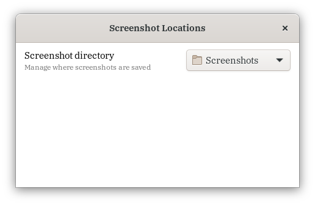

# migration notice

This repository has moved to [Codeberg](https://codeberg.org/kiyui/gnome-shell-screenshotlocations-extension).

# gnome-screenshot-locations-extension

Override GNOME's screenshot functionality to use a user-defined path, in the order of:

1. User defined path (added behaviour)
2. Pictures directory (default behaviour)
3. Home directory (default behaviour)

## installation

Available from GNOME extensions website [here](https://extensions.gnome.org/extension/1179/screenshot-locations/).
